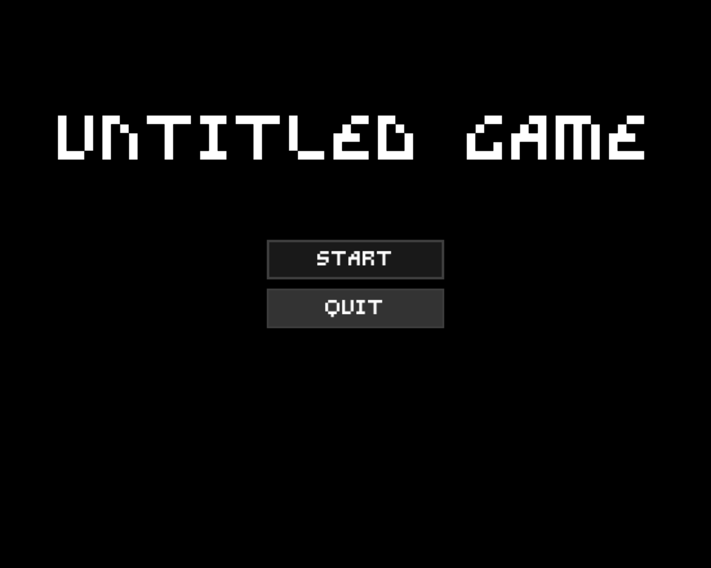
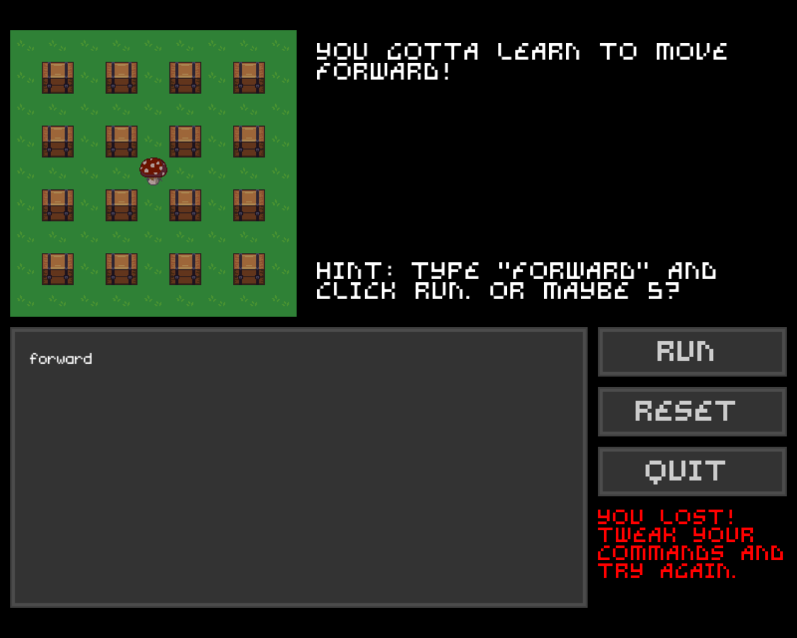

[](https://travis-ci.org/UtkarshMe/WRT)
[](https://codecov.io/gh/UtkarshMe/WRT)

## Write. Run. Tweak. (WRT) `#GitHubGameOff`

> Coders control the world! No, just themselves.

A fun game where you command a mushroom to move around and open boxes; a hybrid of programming and gameplay. Use your coding skills to explore uncharted maps and climb the ladder to a new level. Oh, and collect tomatoes on the way!


### Download
[](https://utkarshme.itch.io/write-run-tweak)

The game is also available to download for Windows or as source code from the
[releases](https://github.com/UtkarshMe/WRT/releases/latest) page.


### Shots!




### Dependencies
- [Love2d](https://love2d.org/): as game engine
- utf8: for user input (`luarocks install utf8`)

##### Dev dependencies
- luacheck: for lint checking
- busted: as test suite
- codecov: for code coverage analysis


### Documentation
- code style guide: [`docs/style_guide.md`](https://github.com/UtkarshMe/WRT/tree/master/docs/style_guide.md)
- testing: [`docs/testing.md`](https://github.com/UtkarshMe/WRT/tree/master/docs/testing.md)


### Build
```bash
make          # does nothing at the moment
make run      # run the game

make test     # run tests (unit + functional)
make unittest
make functionaltest

make lint     # run code lint

make package  # export the game
```


### License
MIT
